<p align="left">
  
</p>

# **LB1 Introduction to MPLAB X and the PIC18 MCU**
This is the introductory laboratory for our course. Here you will give your first steps on Microchip's MPLAB X tool, which we will use in our course to write and compile our code, program the MCU (Microcontroller Unit), debug our programs to find and correct errors, and much more. 

But first, we need to set everything up in our computers. This includes the installation of MPLAB X (the software to develop projects) and the XC8 compiler (the assembly and C compiler to turn programs to machine language). We will also use Git versioning system to upload your projects to a GitHub repository and help you keep a copy of the [class repository](https://github.com/matvazp/TE2015-Microcontroladores) to have code examples and other files used in class. 

We will do all this in this laboratory, which is fully guided and you just need to follow the steps to successfully complete it. Even though some assembly code is given, __you don't need to understand it at this point__, as we will start covering Microchip's assembly language (a.k.a. PIC-AS) in the following weeks. For now you just need to focus on how projects are created, compiled and debugged.

The MCU that we will study in the course is [Microchip's PIC18F57Q43](https://www.microchip.com/en-us/product/PIC18F57Q43), which is a chip that comprises an 8-bit CPU and peripherals such as program and data memory, an analog-to-digital converter, serial communications, and some other useful modules. All the technical information needed to know how to use and program the PIC18F57Q43 MCU is available in a document called the [datasheet](https://ww1.microchip.com/downloads/aemDocuments/documents/MCU08/ProductDocuments/DataSheets/PIC18F27-47-57Q43-Data-Sheet-40002147F.pdf), which is freely available for you to read.

# **Objective**
The final objective of this laboratory is to configure the MCU to generate a clock source signal of __1 MHz__ using the Oscillator module. This module is detailed on section 12 of the [PIC18F57Q43 datasheet](https://ww1.microchip.com/downloads/aemDocuments/documents/MCU08/ProductDocuments/DataSheets/PIC18F27-47-57Q43-Data-Sheet-40002147F.pdf). The clock signal is used by the MCU to pace the instruction execution and has to be configured in all projects. The figure below (Figure 12-1 in the datasheet) shows the block diagram of the clock source circuit of the MCU. In this laboratory, we will use the internal high-frequency oscillator, `HFINTOSC`, to source a frequency of 4 MHz. This oscillator frequency will be then divided by 4 to generate the final 1 MHz clock signal to feed the CPU, as indicated in the signal path highlighted in red on the block diagram.

<div align="center">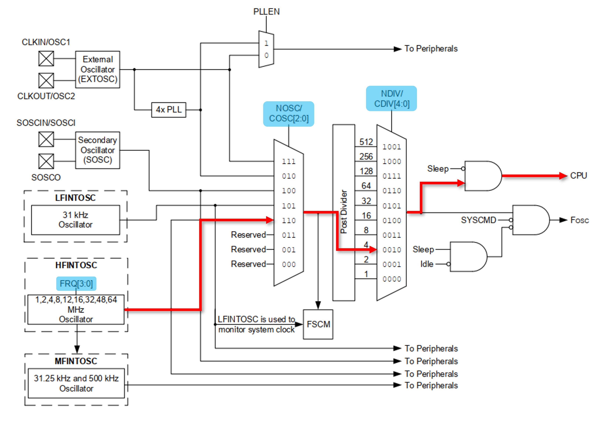</div>

To achieve this, we must assign the corresponding values to the configuration bits highlighted in blue. According to the information given by the datasheet, to make `HFINTOSC` oscillate at 4 MHz, `FRQ[3:0]` must have a value of `b0010`, which is `0x2` in hexadecimal notation. Then, to select `HFINTOSC` as clock source among all other possible sources, `NOSC = b110 = 0x6`. Finally, we divide the oscillator frequency by 4 if we assign `NDIV = b0010 = 0x2`. Notice that both `NOSC` and `NDIV` configuration bits are part of the 8-bit register `OSCCON1`, and `FRQ` is part of the 8-bit register `OSCFRQ` register (neither shown in the block diagram). Also notice that several other ways to achieve a 1 MHz clock signal are possible, either by using internal or external oscillators. The process to achieve the 1 MHz following the path above, from software installation to code compilation and debugging, is detailed in the following sections. 

# **Requirements**
Make sure to have the following before you start the laboratory procedure:
1. Personal computer running either Windows, Mac OS or Linux, with at least 5 Gb of free space
2. A high-speed internet connection
3. Software and repository for the class

<div align="center">

| Step | Tool | Guide |
| :---: | :--- | :--- |
| 1 | MPLAB X IDE | [Installation](../guides/mplabx.md) |
| 2 | XC-8 Compiler | [Installation](../guides/xc8.md) |
| 3 | Git | [Installation](../guides/git.md) |
| 4 | GitHub repository | [1. Create your repository](../guides/github.md) <br> [2. Push to your repository](../guides/github.md) <br> [3. Clone the class repository](../guides/github.md) |

</div>

4. You have completed the LB1 pre-laboratory quiz on Canvas
5. Read carefully the [Deliverables section](#deliverables) of this laboratory beforehand to make sure you 

# **Procedure**

## **1. Create Your First Project**
1. Start MPLAB X and go to *File → Project* and under *Categories*, select the *Microchip Embedded*; then, under *Projects* choose *Standalone Project*. Click *Next* to continue.

<div align="center">
   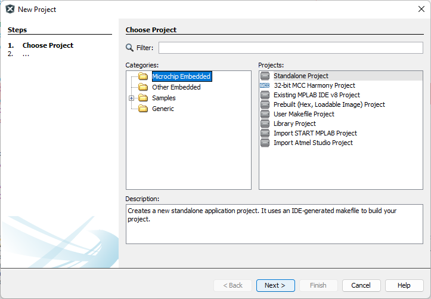
</div>

2. Select the __PIC18F57Q43__ device and choose the *Simulator* tool and click *Next*.

<div align="center">
   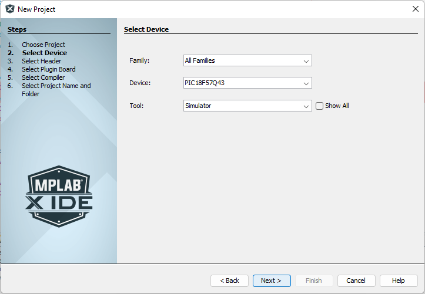
</div>

3. Choose the *pic-as* Compiler Toolchain to build the program and click *Next* (If you are not able to see listed the XC8 Compiler, go back to [XC8 Compiler Installation section](#xc8-compiler-installation) to complete the installation procedure before you continue).

<div align="center">
   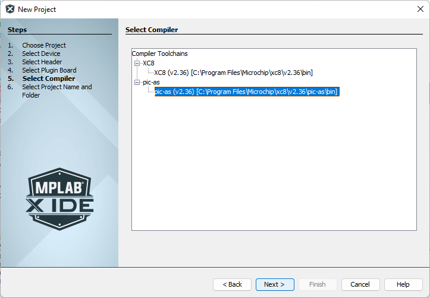
</div>

4. Choose the project location and name your project as "LB1". __Make sure that the project location path, directory and project name have no special characters and/or black spaces__. Leave all the checkboxes as default. Then click *Finish*.

<div align="center">
   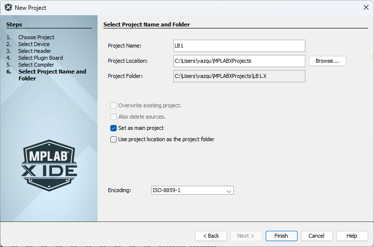
</div>

5. Add a new assembly file by right-clicking on the _Source Files_ folder in your _Project_ window, and select _New -> Other_.

<div align="center">
   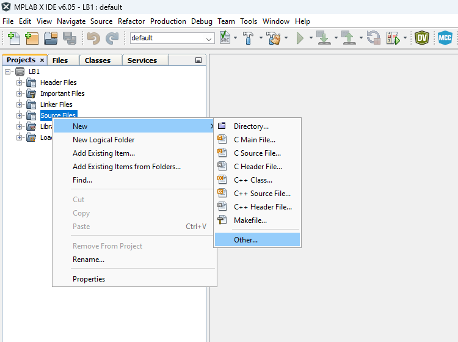
</div>

6. Under _Categories_ select _Assembler_ and choose the `.s` extension file. Click _Next_.

<div align="center">
   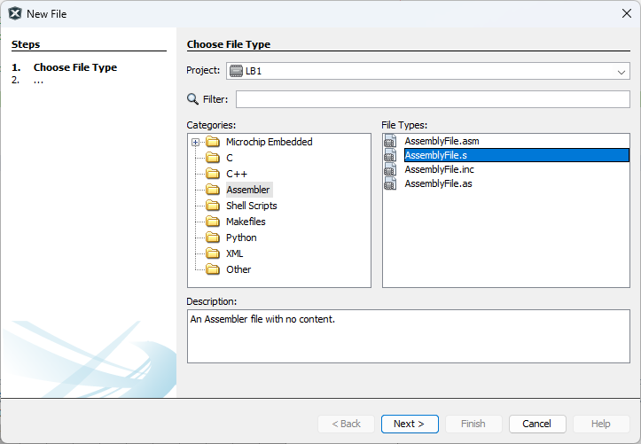
</div>

7. Name your new file as `main` and click _Finish_ to add it to your _Source Files_ folder.

<div align="center">
   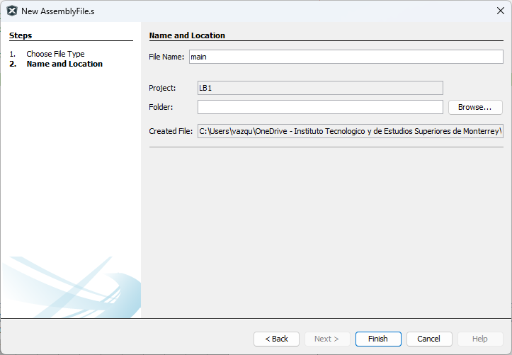
</div>

8. Write the following code on `main.s`. It is important to type in yourself the entire code instead of copy/pasting it. This way you will start becoming familiar with the pic-as language.

```
PROCESSOR   18F57Q43
#include    <xc.inc>
    
PSECT resetVec, class=CODE, reloc=2
PSECT absdata, abs, ovrld
 
absdata:    org	    0x1000
resetVec:   goto    main

PSECT code
main:
    ; To configure the CPU clock to 1 MHz using the HFINTOSC, we can assign 
    ; NOSC/COSC = b110 to select HFINTOSC as the clock source,
    ; FRQ = b10 to give HFINTOSC 4 MHz of frequency, and 
    ; NDIV/CDIV = b10 to divide the frequency by 4
    
    BANKSEL OSCCON1     ; select bank where OSCCON1 belongs to
    movlw   0x62        ; move value 0x62 to WREG
    movwf   OSCCON1, 1  ; move WREG to OSCCON1
    movlw   0x02        ; move value 0x02 to WREG
    movwf   OSCFRQ, 1   ; move WREG to OSCFRQ
END
```

9. Once the code has been captured, go to menu _Production_ and select _Build Project_ to compile your code. The code must compile successfully and the _Output_ terminal must show a _Build Successful_ message. If the project compiling was not successful, verify that you capture the code without typos. 

<div align="center">
   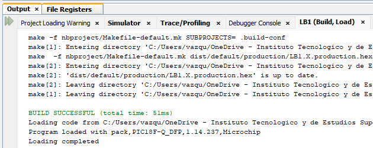
</div>

## **2. MPLAB X Debugger**
Place a [line breakpoint](https://microchipdeveloper.com/mplabx:breakpoints) on line 17 (e.g., `BANKSEL OSCCON1` line) of the given code. A line breakpoint is an indication to the debugger to stop the program execution at the specified line so you can easily see the status of the MCU __before__ the execution of that line. 

<p align="center">
  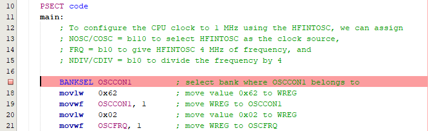
</p>

Run the project debugger by selecting _Debug Project_ under _Debug_ menu. The program will execute normally up to the line breakpoint you just placed. Once this line is reached, the execution will pause so you can check the status of the registers and then continue the program execution, either line by line or continuously. Check the __Debugger Console__ to verify that the program execution has stopped at the specified line:

<p align="center">
  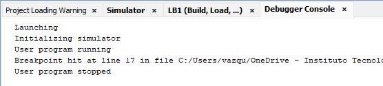
</p>

Once the debugger is running and program exection has stopped at the line breakpoint, the corresponding line will highlight in green with a green arrow indicating that this is the following line to be executed:

<p align="center">
  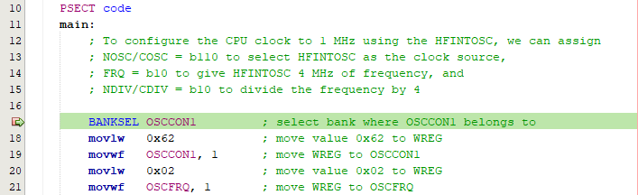
</p>

Select _File Registers_ under _Target Memory Views_ of menu _Window_. The _Files Registers_ window shows a detailed data memory map, including both __Special Function__ and __General Purpose__ registers. Here you can locate every register of your MCU to monitor its current value.

<p align="center">
  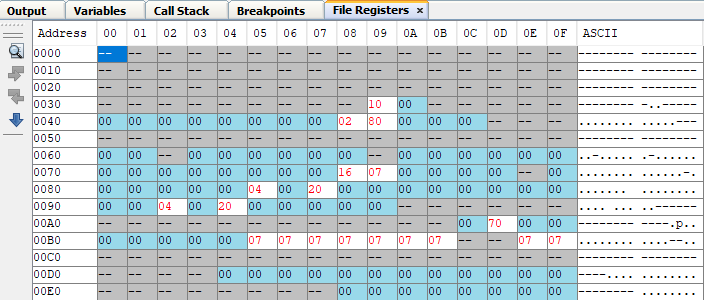
</p>

According to the PIC18F57Q43 datasheet, the `OSCCON1` register address is `0x0AD` (Section 12.6). This can be easily seen on the _File Registers_ map on MPLAB X. To do this, you just need to match row `00A0` and column `0D` to find cell `00AD`, which corresponds to `OSCCON1` register (note that all addresses are given in hexadecimal format).

<p align="center">
  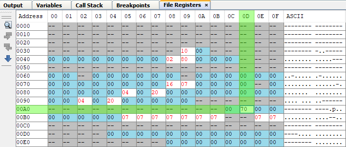
</p>

The `OSCCON1` value at this point is `0x70` and the following lines of code will assign value `0x62` to this register. Select _Step Into_ under _Debug_ menu (or press F7) to execute the line at the breakpoint. Notice how the green arrow moves forward to the next line to be executed (e.g., `movlw 0x62`).

<p align="center">
  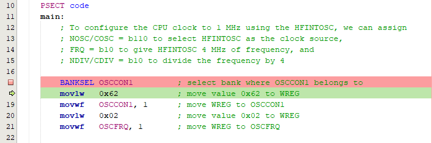
</p>

Execute the next two lines (press F7 twice) to assign the new value to `OSCCON1` and verify the change on the _File Registers_ tab. You should see value `0x62` which means you have changed the configuration of the `OSCCON1` register. Particularly, you assigned `NOSC` with `0x6` and `NDIV` with `0x2`, which belong to `OSCCON1` register. Such values tells the MCU to select the `HFINTOSC` as its clock source, and that the clock source signal is divided by 4 to obtain the final clock signal.

<p align="center">
  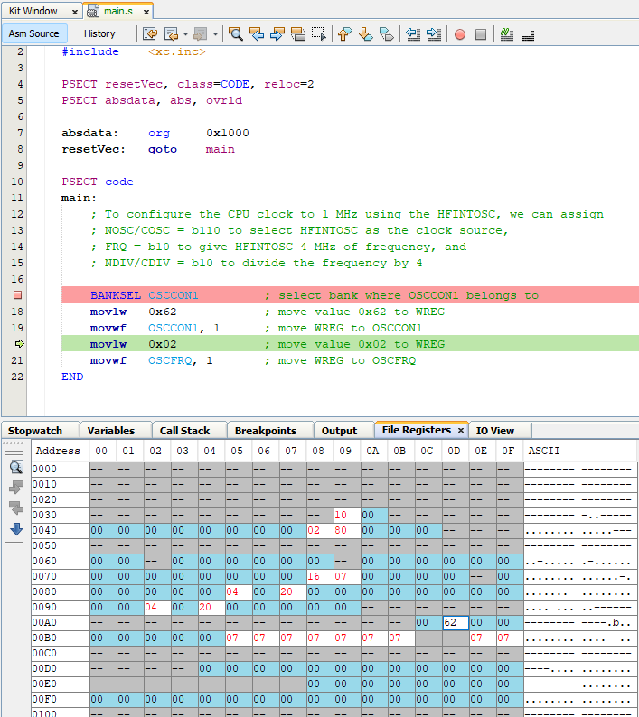
</p>

The next two lines assign value `0x02` to register `OSCFRQ`, which has address `0xB1`. Execute these lines and verify the value at address `0xB1` has changed to `0x02`, as shown below:

<p align="center">
  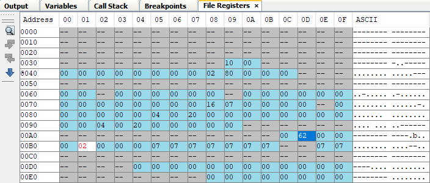
</p>

With the procedure above we have configured a 1 MHz clock signal that is fed to the MCU to execute its assembly instructions. However, this does not mean that the CPU __always__ executes one instruction every clock cycle since this only applies for some instructions while some others might take up to four clock cycles to complete execution. The complete instruction set for the PIC-AS language is also available in the device datasheet (Section 44 - Instruction Set Summary), where you can find detailed information about each instruction, including the clock cycles required for its execution. We will take a deeper look into this in the upcoming laboratories.

# **Deliverables**
__[80%] Demonstrative Video__

Make a __5-minute video tutorial__ where you explain your viewers how to create, compile and debug and MPLAB X project. For this, use the example code given in this laboratory that configure the MCU's clock signal on a frequency of 1 MHz. 

  * __Do not explain what the code does__; instead, focus on explaining MPLAB X project creation and how to monitor the content of registers using the _File Registers_ tab. 

  * Use the procedure followed in this laboratory as a reference for your tutorial, but also __be creative and explore different ways__ to make your tutorial interesting to the viewers. Prepare you tutorial as simple as possible and explain to people that knows nothing about microcontrollers are viewing.

  * Your video must be uploaded to your favorite video platform (YouTube, TikTok, Instagram, etc.). The link to this video will be included on the description file included along your MPLAB X project files that you will push to your GitHub repository.

__[20%] MPLAB X Projects__ 
 
Push your MPLAB X project folder to your GitHub repository. Consider the following:

  * __Your source code must be commented__ to explain what each line does so it can be easily understood by others
  * __Do not compress the project folder__. You must directly push the full project folder and files in their original format using Git
  * __Create a `README.md` to give a short introduction__ to what you did in the laboratory (3 sentences max.). __Also add the link to your demonstrative video__. Consider that the Canvas activity to submit your work will only allowed one external hyperlink entry, thus no other way of reporting your work is possible

The due date for LB7 is __Monday, October 17__. Submit your solution:
<div align="center">

[](https://www.digikey.com.mx/es/articles/why-how-to-use-serial-peripheral-interface-simplify-connections-between-multiple-devices)

</div>